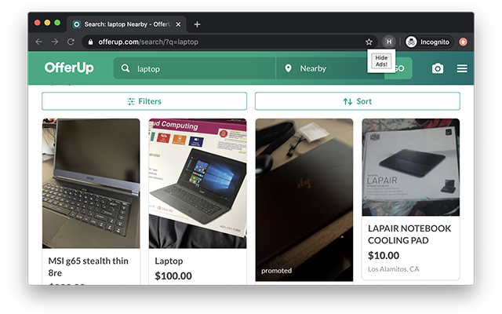

# Hide Ads For OfferUp

A Chrome extension to hide ads in OfferUp search results.

Add this extension to your browser from [chrome web store](https://chrome.google.com/webstore/detail/ddbnmpjfkgepndpglclikflamdlmbgae).



## Publishing

Steps to publish a new version of extension to chrome web store:

* Update version in [manifest.json](manifest.json)
* Add new version and list of changes to [CHANGELOG.md](changelog.md)
* Start a new release from the [release](https://github.com/nbir/hide-ads-for-offerup/releases) section on github.com
* Add new version and text from CHANGELOG.md to the relese
* Prepare extension zip file by running the following command:

```
  zip hide-ads-for-offerup@0.0.0.zip manifest.json popup.html app.js content_script.js
```

* Publish new version of extension using [Chrome Web Store dashboard](https://chrome.google.com/webstore/developer/dashboard) page
